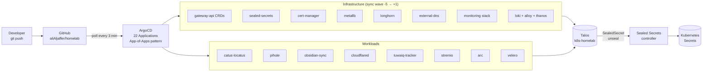
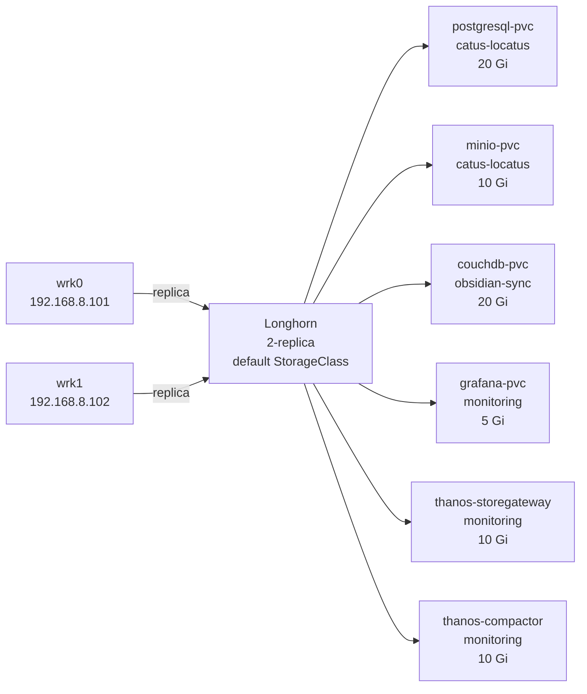

# Cluster Overview

**Cluster:** k8s-homelab  
**Talos:** v1.13.7  
**Kubernetes:** v1.36.2  
**Hardware:** Lenovo M920q Tiny (Intel Core 8th/9th gen, UHD 630 iGPU)

---

## Architecture

```mermaid
graph TD
    subgraph ext["External"]
        Internet(("🌐 Internet"))
        CF["☁️ Cloudflare\n*.alialjaffer.com\n+ Tunnel"]
        GH["🐙 GitHub\naliAljaffer/homelab"]
    end

    subgraph cluster["⚙️ k8s-homelab — Talos v1.13.7 / K8s v1.36.2"]

        subgraph nodes["Nodes — M920q Tiny — Intel UHD 630 iGPU"]
            CP["🖥 cp0\n192.168.8.100\ncontrol-plane\nintel-ucode"]
            W0["🖥 wrk0\n192.168.8.101\nworker\niscsi + i915"]
            W1["🖥 wrk1\n192.168.8.102\nworker\niscsi + i915"]
            W2["⚠️ wrk2\n192.168.8.103\noffline"]
        end

        subgraph net["Network"]
            MLB["MetalLB\n192.168.8.128 – 192.168.8.240"]
            GW["🚪 Cilium Gateway\n192.168.8.129\n*.alialjaffer.com TLS"]
            Pihole["🔒 Pihole\n192.168.8.131\nDNS + Ad-block"]
        end

        subgraph gitops["GitOps — ArgoCD"]
            Argo["🔄 ArgoCD\nargocd.alialjaffer.com\n22 Applications"]
            SS["🔑 Sealed Secrets\ncontroller"]
        end

        subgraph infra["Infrastructure"]
            Cilium["Cilium CNI\nkube-proxy replacement\nHubble UI"]
            CM["cert-manager\nCloudflare DNS01"]
            EDNS["ExternalDNS\nCloudflare provider"]
            LH["Longhorn\n2-replica distributed\nlonghorn.alialjaffer.com"]
        end

        subgraph app_cl["catus-locatus"]
            CLFE["Frontend ×3\nHTTPRoute → catusloc8s.com"]
            CLBE["Backend API ×3\nHTTPRoute → api.catusloc8s.com"]
            PG["PostgreSQL 17\nPostGIS\n20 Gi Longhorn PVC"]
            MinIO["MinIO\n10 Gi Longhorn PVC\nbuckets: thanos / loki / velero"]
        end

        subgraph app_obs["Monitoring — monitoring ns"]
            Prom["Prometheus\n2-day local TSDB"]
            Thanos["Thanos\nstore + compactor + query\n∞ retention → MinIO"]
            Loki["Loki\nS3 mode → MinIO\n90-day retention"]
            Alloy["Grafana Alloy\nDaemonSet\nlog collector"]
            Grafana["Grafana\ngrafana.alialjaffer.com\n5 Gi Longhorn PVC"]
        end

        subgraph app_other["Other Workloads"]
            CouchDB["CouchDB\nobsidian-sync\n20 Gi Longhorn PVC\n192.168.8.134"]
            CFD["Cloudflared ×2\ncloudflared ns\nTunnel → tuwaiqtracker.com"]
            Stremio["Stremio\nstremio ns"]
            TT["tuwaiq-tracker\nCronJob 0 */12 * * *"]
            ARC["GitHub ARC\narc-systems + arc-runners\nHelm v0.14.2"]
            Velero["Velero\nbackups → MinIO/velero"]
        end

    end

    %% External traffic
    Internet --> CF
    CF -- "DNS A records\n(ExternalDNS)" --> GW
    CF -- "Cloudflare Tunnel" --> CFD

    %% GitOps
    GH -- "App-of-Apps\ninfrastructure + workloads" --> Argo
    Argo -- "sync" --> infra
    Argo -- "sync" --> app_cl
    Argo -- "sync" --> app_obs
    Argo -- "sync" --> app_other

    %% Network
    MLB --> GW
    MLB --> Pihole
    MLB --> CouchDB
    GW --> CLFE
    GW --> CLBE
    GW --> Grafana
    GW --> Argo

    %% catus-locatus internals
    CLBE --> PG
    CLBE --> MinIO

    %% Monitoring
    Prom -- "upload blocks" --> Thanos
    Thanos -- "long-term store" --> MinIO
    Loki -- "log chunks" --> MinIO
    Alloy -- "ship logs" --> Loki
    Grafana -- "query" --> Thanos
    Grafana -- "query" --> Loki

    %% cert-manager
    CM -- "DNS01 challenge" --> CF

    %% Storage backing
    PG -.->|"Longhorn PVC"| LH
    MinIO -.->|"Longhorn PVC"| LH
    CouchDB -.->|"Longhorn PVC"| LH
    Grafana -.->|"Longhorn PVC"| LH
```

---

## Network addresses

| Service | IP / Hostname | Protocol |
|---|---|---|
| Cilium Gateway (HTTPS) | 192.168.8.129 | HTTPS — *.alialjaffer.com |
| Pihole DNS | 192.168.8.131 | DNS (UDP 53) |
| CouchDB (Obsidian) | 192.168.8.134 | HTTP 5984 |
| MetalLB pool | 192.168.8.128 – 192.168.8.240 | — |

## Public subdomains (via ExternalDNS + Cloudflare)

| URL | Service |
|---|---|
| argocd.alialjaffer.com | ArgoCD |
| grafana.alialjaffer.com | Grafana |
| longhorn.alialjaffer.com | Longhorn UI |
| hubble.alialjaffer.com | Hubble (Cilium) |
| minio.alialjaffer.com | MinIO console |
| pihole.alialjaffer.com | Pihole web UI |

---

## GitOps flow

---

## Storage volumes (Longhorn)

